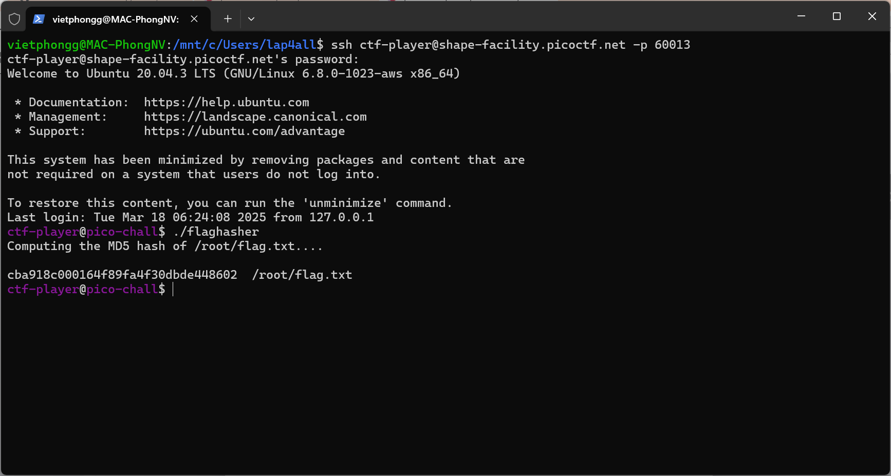

# Description

Here is a binary that has enough privilege to read the content of the flag file but will only let you know its hash. If only it could just give you the actual content!  
Connect using ssh ctf-player@shape-facility.picoctf.net -p 60013 with the password, 6dd28e9b and run the binary named "flaghasher".  
You can get a copy of the binary if you wish: scp -P 60013 ctf-player@shape-facility.picoctf.net:~/flaghasher .  

# Write-up

Từ mô tả, mình ssh tới ctf-player@shape-facility.picoctf.net -p 60013. Sau đấy run file binary thử và kết quả :

## Step 1: phân tích bằng IDA Pro

Mình lấy file binary về bằng SCP, sau đó sử dụng IDA Pro để disassemble. Từ hàm `main()`, mình phát hiện rằng binary sẽ gọi lệnh `system md5sum` để tính hash của tệp `/root/flag.txt`.

## Step 2: Tạo một wrapper cho md5sum

Tiếp theo, từ việc phát hiện `flaghasher` gọi `/bin/bash -c 'md5sum /root/flag.txt'` mình thử tạo một script giả mạo md5sum:

# Flag 
picoCTF{sy5teM_b!n@riEs_4r3_5c@red_0f_yoU_04d0aaff}

