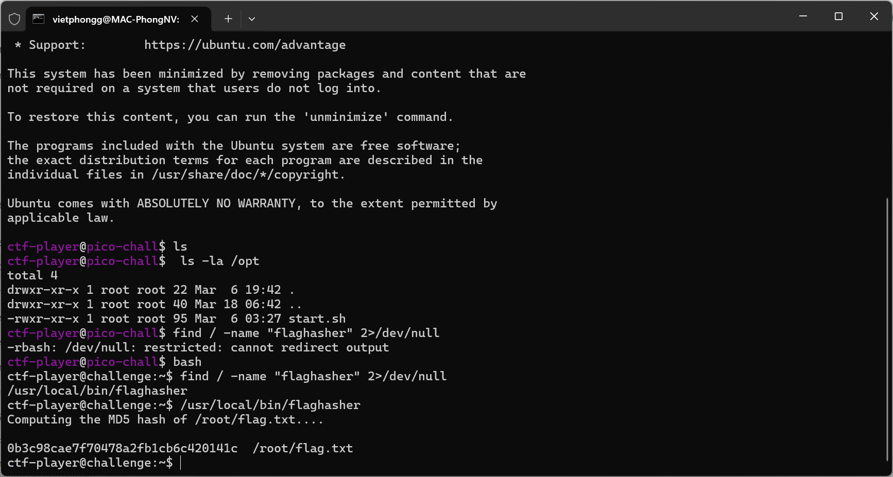
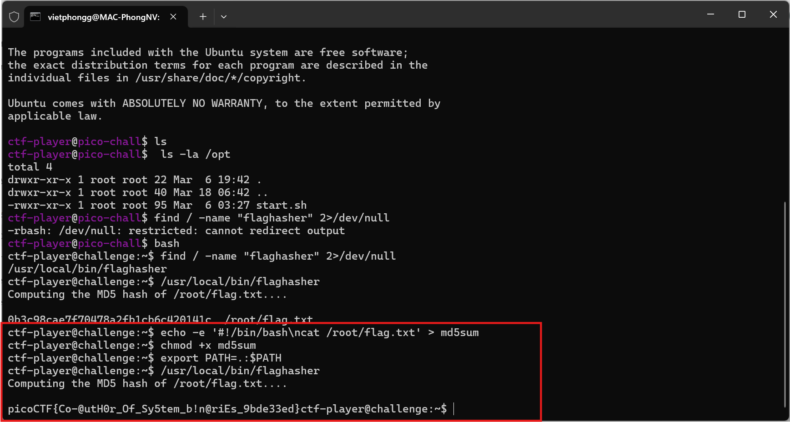

# Description

Here is a binary that has enough privilege to read the content of the flag file but will only let you know its hash.  
If only it could just give you the actual content!
Connect using ssh ctf-player@rescued-float.picoctf.net -p 49480 with the password, 8d076785 and run the binary named "flaghasher".

# Write-up

Tương tự với hash-only-1 nhưng khác là sau khi ssh vào ctf-player@rescued-float.picoctf.net -p 49480 sẽ không thấy file binary ngay 

## Step 1: Tìm `flaghasher`

• Khi sử dụng `find / -name "flaghasher" 2>/dev/null`, mình nhận được thông báo `-rbash: /dev/null: restricted: cannot redirect output`, tức là đang bị hạn chế trong một `restricted shell` (rbash).      
• Sử dụng `bash` để thoát khỏi `rbash`.  
• Sau đó, mình đã tìm được `flaghasher` nằm ở `/usr/local/bin/flaghasher`, chạy thử binary này và nhận kết quả:  

## Step 2: Tạo một wrapper cho md5sum

Áp dụng phương pháp cũ : tạo một script giả mạo md5sum

# Flag
picoCTF{Co-@utH0r_0F_Sy5tem_b!n@riEs_9bde33ed}

