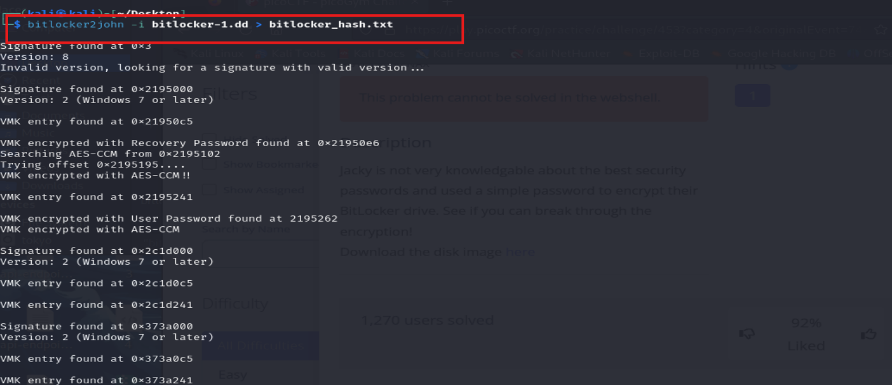
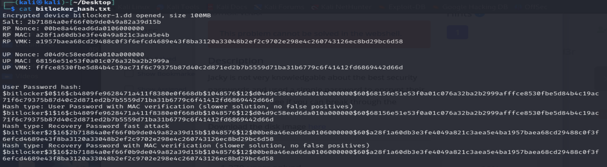
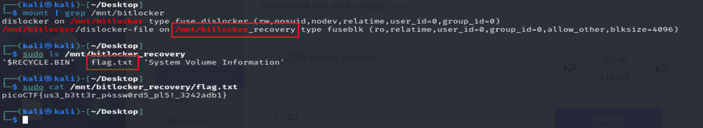
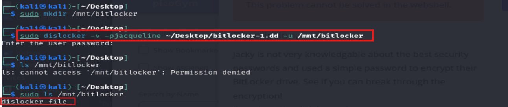
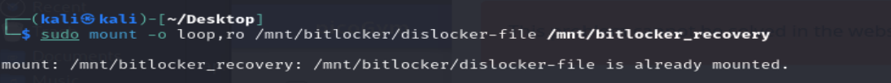

# Description

Jacky is not very knowledgable about the best security passwords and used a simple password to encrypt their BitLocker drive. See if you can break through the encryption!
Download the disk image here
## Hint :   
  - Hash cracking

# Write-up

Từ mô tả và hint mình cần tìm được hash của bitlock từ `disk image.dd`

## Step 1: Extract BitLocker Metadata

### Sử dụng `John the Ripper`  

Mình có được `password_hash`  

  

## Step 2: Hash cracking

Sử dụng `hashcat` để crack password_hash ta có được password : `jacqueline`

  

## Step 3 : giải mã ổ đĩa
Sử dụng `dislocker` để giải mã `bitlocker-1.dd` bằng `password` vừa crack được ở trên

File dislocker-file trong thư mục /mnt/bitlocker_mount là một file giải mã từ ổ đĩa BitLocker.  
Để truy xuất dữ liệu từ file này và có thể lấy được flag, cần phải mount file này để có thể truy cập vào hệ thống file của ổ đĩa đã được giải mã.  
Sử dụng kèm `-o ro (read-only)` để tránh lỗi 

Kiểm tra xem ổ đĩa đã được mount hay chưa bằng cách sử dụng lệnh `mount`  

# Flag
picoCTF{us3_b3tt3r_p4ssw0rd5_pl5!_3242adb1}

