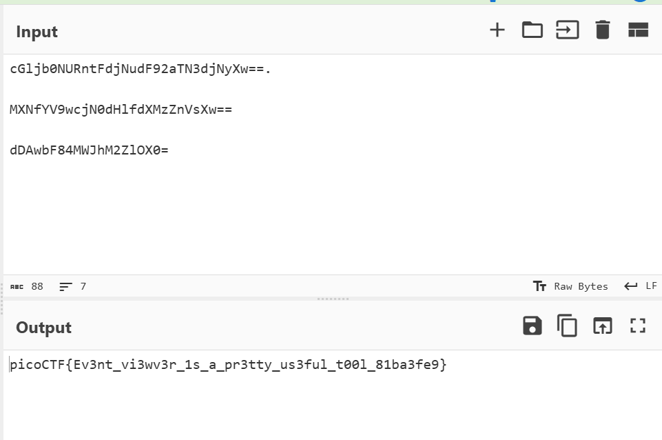
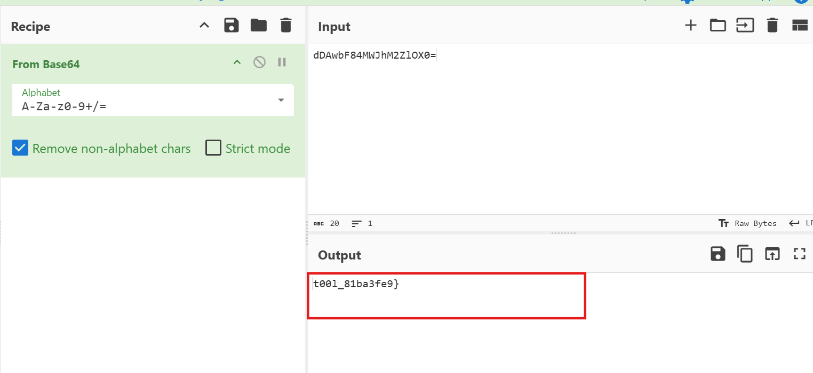
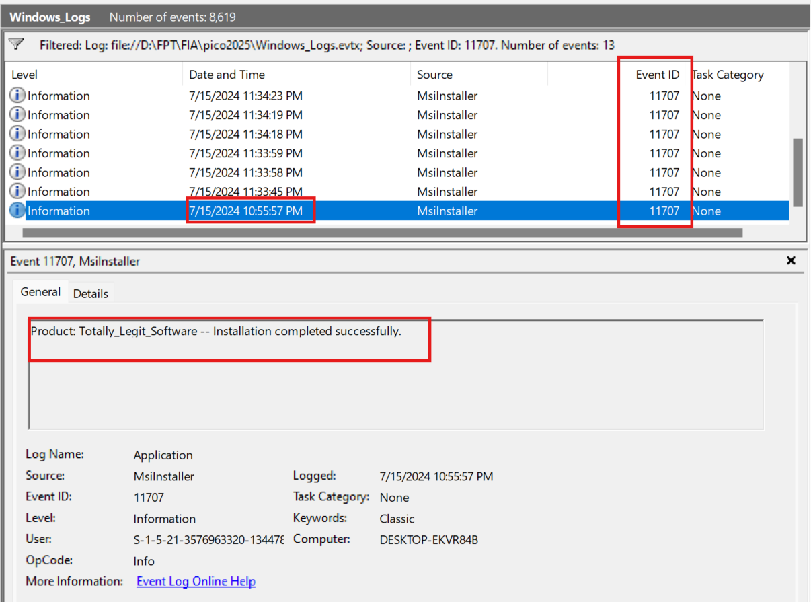
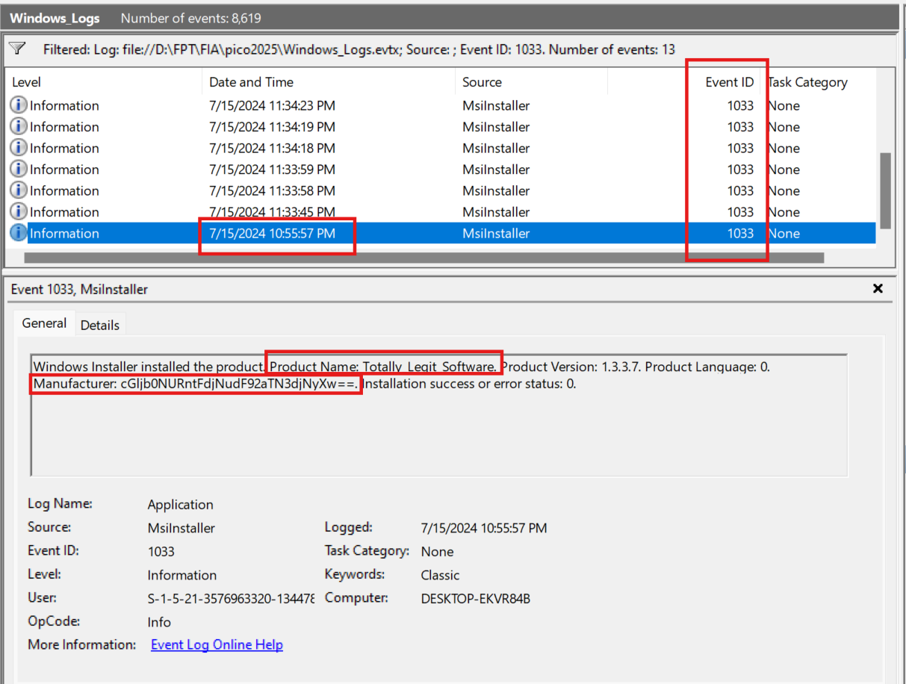

# Description

One of the employees at your company has their computer infected by malware! Turns out every time they try to switch on the computer, it shuts down right after they log in. The story given by the employee is as follows:  
They installed software using an installer they downloaded online  
They ran the installed software but it seemed to do nothing  
Now every time they bootup and login to their computer, a black command prompt screen quickly opens and closes and their computer shuts down instantly.  
See if you can find evidence for the each of these events and retrieve the flag (split into 3 pieces) from the correct logs!
Download the Windows Log file here  
## Hint :   
  - Try to filter the logs with the right event ID    
  - What could the software have done when it was ran that causes the shutdowns every time the system starts up?  

# Write-up

Từ mô tả và các hint thì mình có thể hiểu luồng sự kiện sẽ là từ lúc cài đặt 1 phần mềm lạ và các sự kiện cuối là shutdown  
Mình sẽ sử dụng `Event Viewer` trong challange này 

## Step 1: Lọc các event_ID

### 1033 - 11707 - 7045

Người dùng cài đặt phần mềm không rõ nguồn gốc → Cần kiểm tra xem phần mềm nào được cài đặt.
MsiInstaller ghi lại thông tin về phần mềm cài đặt, đường dẫn file, thời gian cài đặt, giúp xác định ứng dụng đáng ngờ. 

## Step 2: Research và xác định phương pháp

Sau khi research mình tạm hiểu "Mặc dù địa chỉ của bộ nhớ có thể thay đổi giữa các lần chạy do ASLR, nhưng  khoảng cách (offset) giữa các địa chỉ trong cùng một segment của binary vẫn giữ nguyên. Do đó, nếu có thể leak một địa chỉ nào đó trong segment chứa win(), ta có thể tính toán địa chỉ chính xác của win() trên server."      

Ở đây ta xác định được địa chỉ của `win()` từ binary bằng `gdb()` là : `0x55555555536a`  
Quay lại với output của các lần thử trước đó ở `Step 1` mình thấy 1 địa chỉ đáng ngờ là : `0x599f2ad11441` tạm gọi là X  
Thử input tương tự `Step_1` trên file binary ta có địa chỉ của X : `0x555555555441`  

## Step 3 : Tính offset 

### 1. Trong binary (local)
- `X = 0x555555555441`
- `win = 0x55555555536a`
- Offset :  
      offset = X - win = 0x555555555441 - 0x55555555536a = `0xD7`
### 2. Trên server (leaked address)
- `X_server = 0x599f2ad11441`
- `win_server` : 
      `win_server` = X_server - offset win_server = 0x599f2ad11441 - 0xD7 = `0x599f2ad1136a`

# Flag
picoCTF{p13_5h0u1dn'7_13ak_2509623b}

