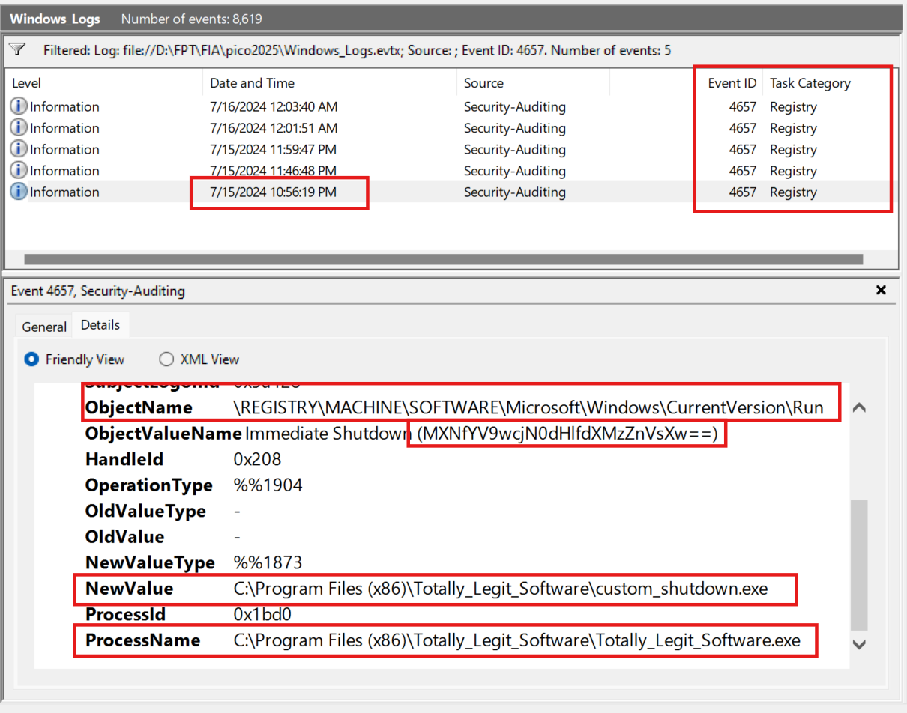
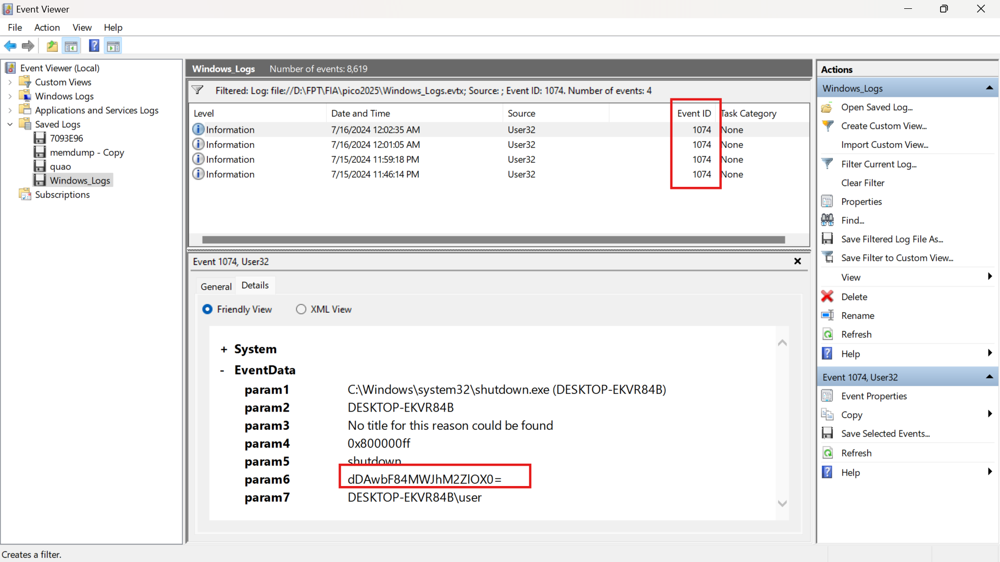

# Description

One of the employees at your company has their computer infected by malware! Turns out every time they try to switch on the computer, it shuts down right after they log in. The story given by the employee is as follows:  
They installed software using an installer they downloaded online    
They ran the installed software but it seemed to do nothing    
Now every time they bootup and login to their computer, a black command prompt screen quickly opens and closes and their computer shuts down instantly.  
See if you can find evidence for the each of these events and retrieve the flag (split into 3 pieces) from the correct logs!
Download the Windows Log file here  
## Hint    
  - Try to filter the logs with the right event ID    
  - What could the software have done when it was ran that causes the shutdowns every time the system starts up?  

# Write-up

Từ mô tả và các hint thì mình có thể hiểu luồng sự kiện sẽ là từ lúc cài đặt 1 phần mềm lạ và các sự kiện cuối là shutdown  
Mình sẽ sử dụng `Event Viewer` trong challange này 

## Step 1: Lọc các event_ID install app

### 1033 - 11707 - 7045

Người dùng cài đặt phần mềm không rõ nguồn gốc → Cần kiểm tra xem phần mềm nào được cài đặt.  
  
MsiInstaller ghi lại thông tin về phần mềm cài đặt, đường dẫn file, thời gian cài đặt, giúp xác định ứng dụng đáng ngờ.   
  
Với `11707` ta chú ý tới 1 phần mềm lạ kèm móc thời gian được cài đặt 

Với `1033` tiếp tục dựa vào móc thời gian từ `11707` ta xác định được việc cài đặt phần mềm này được ghi lại kèm với 1 dữ liệu lạ giống base64 : `cGljb0NURntFdjNudF92aTN3djNyXw==` -> `picoCTF{Ev3nt_vi3wv3r_`  
  

## Step 2: Lọc các event_ID Registry Modification

Theo đề bài khi máy khởi động thì shutdown ngay lập tức có thể Malware đã sử dụng registry để tự khởi động khi máy tính bật lên    
Với móc thời gian từ kết quả ở trên ta tìm được 1 event đáng ngờ   
  
Object Name: `\REGISTRY\MACHINE\SOFTWARE\Microsoft\Windows\CurrentVersion\Run`  
-> Đây là key quan trọng trong Windows, dùng để chạy ứng dụng khi khởi động.  
  
Process Name:`C:\Program Files (x86)\Totally_Legit_Software\Totally_Legit_Software.exe`  
-> Chương trình này không phải phần mềm hợp lệ, có dấu hiệu giả mạo.  
  
Object Value Name `(MXNfYV9wcjN0dHlfdXMzZnVsXw==)`  
-> Giá trị này có dạng Base64, khi decode ta được chuỗi : `1s_a_pr3tty_us3ful_`

  

## Step 3 : Lọc các event_ID shutdown

Hiện tại mình đã xác định được phần mềm này tạo key trong registry để tự động shutdown ngay khi đăng nhập. Mình sẽ tìm các event shutdown do shutdown.exe gây ra bằng `event_ID = 1074`  

`Comment: dDAwbF84MWJhM2ZlOX0=`  ->   `t00l_81ba3fe9}` 

# Flag
picoCTF{Ev3nt_vi3wv3r_1s_a_pr3tty_us3ful_t00l_81ba3fe9}

