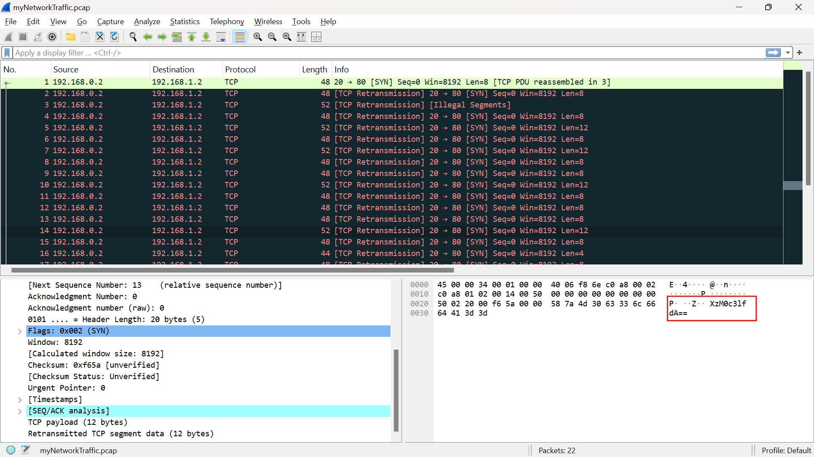
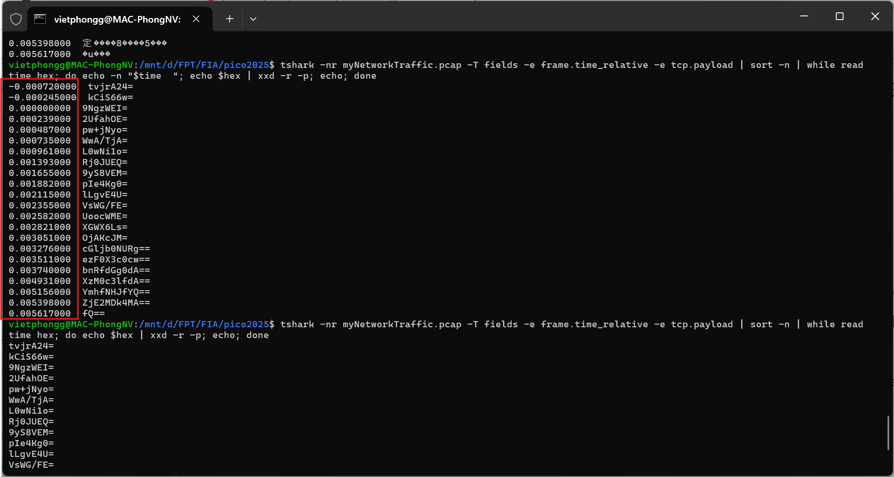
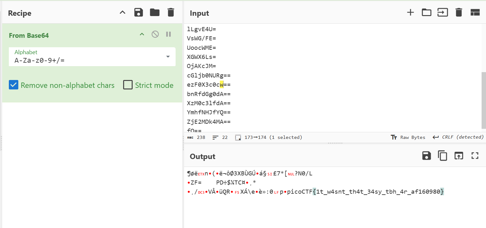

# Description

A digital ghost has breached my defenses, and my sensitive data has been stolen! 😱💻 Your mission is to uncover how this phantom intruder infiltrated my system and retrieve the hidden flag.  
To solve this challenge, you'll need to analyze the provided PCAP file and track down the attack method. The attacker has cleverly concealed his moves in well timely manner. Dive into the network traffic, apply the right filters and show off your forensic prowess and unmask the digital intruder!  
Find the PCAP file here Network Traffic PCAP file and try to get the flag.
## Hint  
  - Filter your packets to narrow down your search.
  - Attacks were done in timely manner.
  - Time is essential

# Write-up

Từ mô tả và hint mình có thể hiểu được sẽ phải chú trọng vào `timestamp`

## Step 1: Xem tổng thể bằng Wireshark
Có thể thấy ở payload TCP của các gói tin có dạng data base64

## Step 2: Sử dụng TShark để xuất payload

Hiển thị TCP payload theo thời gian dưới dạng ASCII.

 

Sau đấy bỏ bớt phần hiển thị `frame.time_relative` để tiện copy vào `cyberchef`

# Flag
picoCTF{1t_w4snt_th4t_34sy_tbh_4r_af160980}

